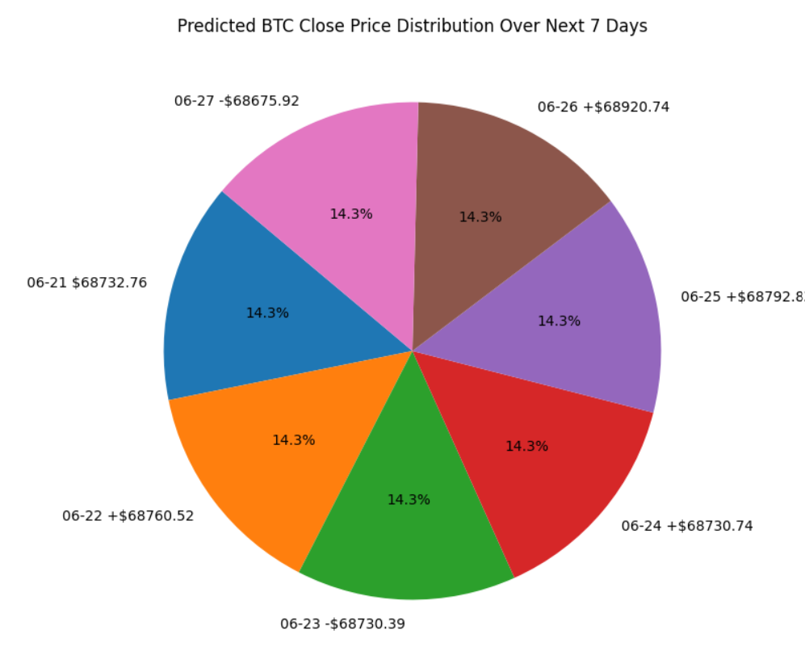

# Bitcoin-Cryptocurrency-Price-Prediction
📊 Bitcoin Price Prediction (Next 7 Days) is a data-driven machine learning project aimed at forecasting the closing prices of Bitcoin over a short 7-day horizon. Using historical cryptocurrency data enriched with technical indicators, this project applies a supervised learning model to gain valuable price movement insights 📈. Our objective is to give traders, analysts, and enthusiasts a quick glimpse of where BTC might be heading in the near term — all through automation and visualization.
💡 The model behind this prediction is a Random Forest Regressor, a robust ensemble algorithm well-suited for handling complex, non-linear time series data without needing heavy feature scaling. To train this model, we utilized key technical indicators such as SMA, RSI, MACD, Bollinger Bands (BB_High, BB_Low), and even correlated asset prices like ETH_Close. We also used time-shifted features like BTC_Close_Lag1 to simulate realistic rolling forecasts — updating past values sequentially with each predicted day 🔁.
📚 The data science pipeline involved thorough preprocessing using pandas and NumPy, model training and validation via scikit-learn, and saving the trained model with joblib. For visualization, we leveraged Matplotlib to create:
🥧 A pie chart showing the percentage share of predicted prices, clearly marked with + or – to represent daily price changes.
📉 A trend line chart that makes it easy to spot upward or downward momentum across the 7 forecasted days.
🔍 While the current version of the project only predicts 7 days of future BTC close prices, it sets the stage for more advanced forecasting. Our focus remains on enhancing prediction accuracy, experimenting with deeper models like XGBoost and LSTM, and eventually scaling this into a real-time predictive tool with live data ingestion 🌐.
🚧 This project is still evolving. We're actively working on improving feature engineering, model tuning, and accuracy evaluation metrics. So stay tuned — this is not the end! 🚀

